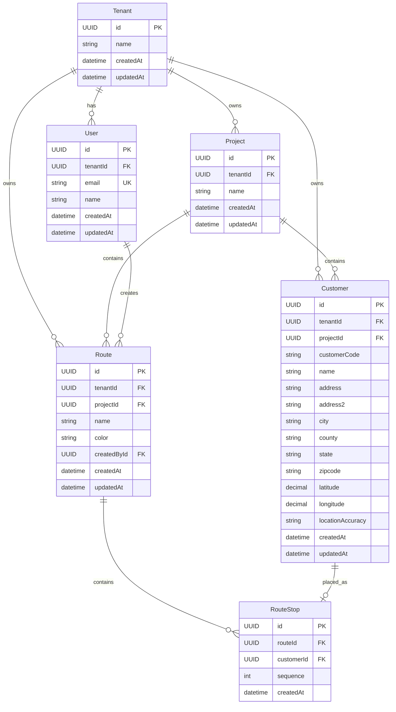

# Route builder Data Model

## Decisions

- **Project:** groups customers and routes. Every customer and route belongs to exactly one project. Map, filters, search, import and route list are all scoped to a project.
- **Customer code:** `customerCode` is unique per project (`unique(projectId, customerCode)`), not per tenant. The same customer can exist in two projects as two rows, each on its own route.
- **One route per customer:** `RouteStop.customerId` stays unique. Because customer rows are project-scoped, this already means one route per customer per project.
- **Cross-project stops:** the DB can't cheaply enforce that a stop's route and customer share a project. The service that adds stops checks it.
- **Tenant on Customer and Route:** redundant with `Project.tenantId`, kept because every query and index is scoped on it.
